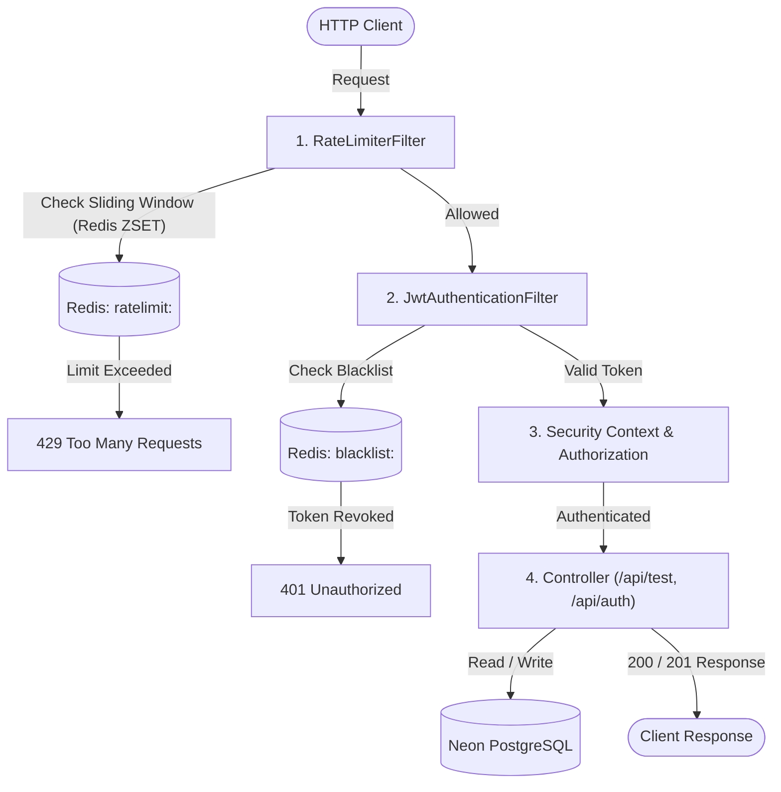

# AuthGuard Service

[](https://spring.io/projects/spring-boot)
[](https://openjdk.org/projects/jdk/21/)
[](LICENSE)

**AuthGuard** is a production-grade, memory-efficient distributed authentication and rate-limiting service built with **Spring Boot 3 (Jakarta EE)**, **Spring Security 6**, **Spring Data JPA**, and **Redis**.

It is engineered specifically for low-overhead deployment (such as a **1 GB RAM AWS Lightsail / VPS instance**) using stateless JWTs, atomic sliding-window rate limiting via Redis ZSETs, and pooled PostgreSQL connectivity (Neon / Supabase).

---

## 1. System Architecture

### Request Flow Diagram



### Text Flow

```text
Client Request
    │
    ▼
[RateLimiterFilter] ─────────► (Queries Redis ZSET: ratelimit:<IP/User>)
    │                              ├─► If count >= max: 429 Too Many Requests
    ▼                              └─► If count < max: adds timestamp & continues
[JwtAuthenticationFilter] ────► (Queries Redis Key: blacklist:<token>)
    │                              ├─► If blacklisted: 401 Unauthorized
    ▼                              └─► If valid: parses claims & sets SecurityContext
[Spring Security Filter Chain]
    │
    ▼
[Controller Layer] ──────────► (PostgreSQL Neon via bounded Hikari pool)
```

---

## 2. Distributed Redis Components

### A. Sliding-Window Rate Limiter (`RedisRateLimiterService`)
Traditional fixed-window counters allow 2x traffic bursts at boundary edges. AuthGuard implements an atomic **Sliding-Window Log** using Redis sorted sets (`ZSET`):

1. **Eviction**: `opsForZSet().removeRangeByScore(key, 0, now - windowSizeMs)` removes timestamps older than the sliding window.
2. **Cardinality**: `opsForZSet().zCard(key)` counts the exact requests executed in the sliding window.
3. **Recording**: If `count < maxRequests`, adds member `<timestamp>:<salt>` with score `<timestamp>`.
4. **Auto-Expiry**: `expire(key, windowSeconds + 1)` cleans up inactive keys from memory.
5. **Fail-Open Strategy**: If Redis is temporarily degraded, requests are permitted rather than cascading service downtime.

### B. Token Blacklisting Lifecycle (`TokenBlacklistService`)
Unlike stateful sessions, JWT revocation is handled statelessly with zero orphan key accumulation:

1. Client calls `POST /api/auth/logout` with Bearer token.
2. The remaining token lifetime is parsed: `remainingTtlMs = expiration - now`.
3. Stored in Redis: `SET blacklist:<jwt_token> "revoked" EX <remainingTtlMs>`.
4. Once the token naturally reaches its expiration, Redis automatically purges it. No manual garbage collection required.

---

## 3. Resource Tuning for 1 GB RAM & Neon PostgreSQL

### Memory Budget Allocation

| Component | Allocated RAM | Strategy / Tuning |
| :--- | :--- | :--- |
| **JVM Maximum Heap** | `384 MB` | `-Xms128m -Xmx384m` |
| **JVM Garbage Collector** | `~20 MB overhead` | `-XX:+UseSerialGC` (Low metadata footprint) |
| **Local Redis Server** | `~30 MB` | `maxmemory 64mb` + `allkeys-lru` |
| **Linux OS & Buffers** | `~350 MB` | Swappiness tuned, headless kernel |
| **Remaining Headroom** | `~200 MB` | Safety margin against Out-Of-Memory (OOM) killer |

### HikariCP Connection Bounding
Neon Serverless Postgres functions on transaction pooling. Uncontrolled pool sizes will quickly exhaust Neon connection limits and consume VPS memory:

```properties
# src/main/resources/application.properties
spring.datasource.hikari.maximum-pool-size=3
spring.datasource.hikari.minimum-idle=1
spring.datasource.hikari.idle-timeout=30000
```

---

## 4. Environment Variables Reference

| Variable | Description | Default / Example |
| :--- | :--- | :--- |
| `DB_URL` | Neon JDBC Connection String (pooled) | `jdbc:postgresql://ep-xyz-pooler.neon.tech/neondb?sslmode=require` |
| `DB_USER` | Neon Database User | `neondb_owner` |
| `DB_PASSWORD` | Neon Database Password | *(Required in production)* |
| `REDIS_HOST` | Redis Server Host | `localhost` |
| `REDIS_PORT` | Redis Server Port | `6379` |
| `REDIS_PASSWORD` | Redis Server Password | `""` (Empty for local Redis) |
| `REDIS_SSL` | Enable Redis SSL/TLS | `false` (`true` for Upstash / Redis Cloud) |
| `JWT_SECRET` | 256-bit HMAC SHA key | 64+ character Base64 or Hex string |

---

## 5. Quick Start & Deployment

### Local Development

1. Ensure **PostgreSQL** and **Redis** are running locally.
2. Run the application:
   ```bash
   ./mvnw spring-boot:run
   ```

### Docker Deployment (1 GB VPS)

Build and run the lightweight container (Eclipse Temurin 21 Alpine):

```bash
# Build multi-stage Docker image
docker build -t authguard-service:latest .

# Run with tuned JVM flags and environment variables
docker run -d \
  --name authguard \
  --restart unless-stopped \
  -p 8080:8080 \
  -e DB_URL="jdbc:postgresql://your-neon-host.neon.tech/neondb?sslmode=require" \
  -e DB_USER="neondb_owner" \
  -e DB_PASSWORD="your_password" \
  -e REDIS_HOST="localhost" \
  -e REDIS_PORT="6379" \
  -e JWT_SECRET="your_secure_256bit_secret_key" \
  authguard-service:latest
```

---

## 6. API Reference

### 1. Register User
```bash
curl -X POST http://localhost:8081/api/auth/register \
  -H "Content-Type: application/json" \
  -d '{"email":"user@example.com", "password":"securePassword123"}'
```

**Response (201 Created):**
```json
{
  "token": "eyJhbGciOiJIUzI1NiIsInR5cCI6IkpXVCJ9...",
  "tokenType": "Bearer",
  "email": "user@example.com",
  "role": "ROLE_USER",
  "message": "Authentication successful"
}
```

### 2. Login
```bash
curl -X POST http://localhost:8081/api/auth/login \
  -H "Content-Type: application/json" \
  -d '{"email":"user@example.com", "password":"securePassword123"}'
```

**Response (200 OK):**
```json
{
  "token": "eyJhbGciOiJIUzI1NiIsInR5cCI6IkpXVCJ9...",
  "tokenType": "Bearer",
  "email": "user@example.com",
  "role": "ROLE_USER",
  "message": "Authentication successful"
}
```

### 3. Access Protected Profile
```bash
curl -X GET http://localhost:8081/api/test/profile \
  -H "Authorization: Bearer <YOUR_JWT_TOKEN>"
```

**Response (200 OK):**
```json
{
  "email": "user@example.com",
  "role": "ROLE_USER",
  "message": "Access granted to protected endpoint. Token and rate limit successfully validated."
}
```

### 4. Logout (Revoke Token)
```bash
curl -X POST http://localhost:8081/api/auth/logout \
  -H "Authorization: Bearer <YOUR_JWT_TOKEN>"
```

**Response (200 OK):**
```json
{
  "message": "Logged out successfully. Token invalidated."
}
```

Subsequent calls using the logged-out token will return `401 Unauthorized`.
